---

# Modul 8: Arsitektur Microservices untuk Sistem Terdistribusi  
**Nama:** Aditya Wisnu Naraya  
**NIM:** 235410069   
---

## 0. Pengantar
Microservices adalah salah satu arsitektur yang banyak digunakan pada sistem terdistribusi. Dengan menggunakan arsitektur ini, perangkat lunak terdiri atas *frontend* yang berisi UI/UX sebagai titik interaksi antara pengguna dengan aplikasi. Sisi *frontend* tersebut kemudian meminta layanan (*services*) dari *backend*.

Saat ini, *service* dapat dibuat menggunakan **REST API**, **GraphQL**, atau **gRPC**. Praktik pada mata kuliah ini menggunakan **REST API** dengan pustaka **FastAPI** dan **SQLModel** (ORM dari Python).

---

## 1. Prasyarat

Untuk mengerjakan materi pada pertemuan ini, pastikan Anda telah memenuhi prasyarat berikut:

1. **Software `uv`:** Telah terinstall dan dipahami cara penggunaannya. [Lihat panduan praktis](https://github.com/NEO-X-School/notes/blob/main/uv/00.md).


2. **Instalasi Python:** Gunakan `uv` untuk menginstall **Python 3.14.4**.  
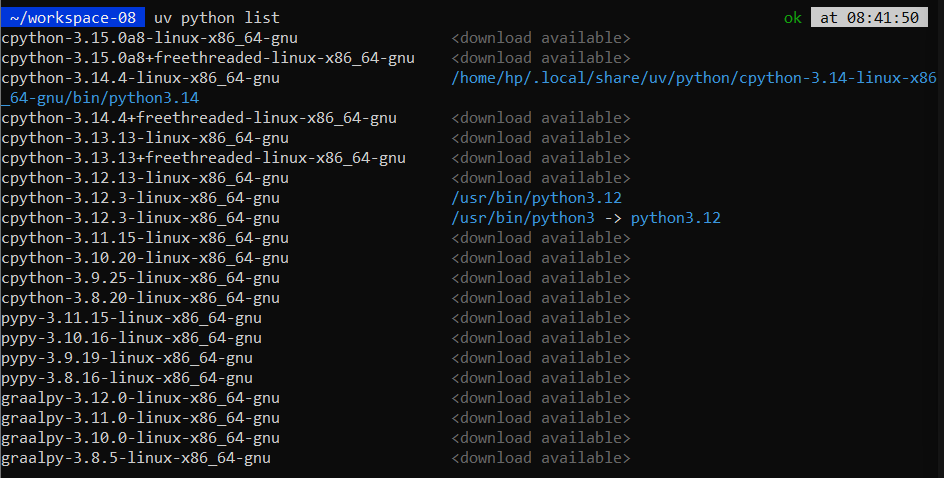
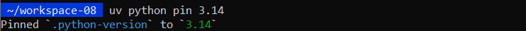
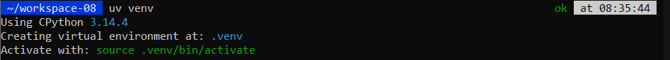
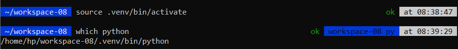

3. **Install FastAPI & SQLModel:**  
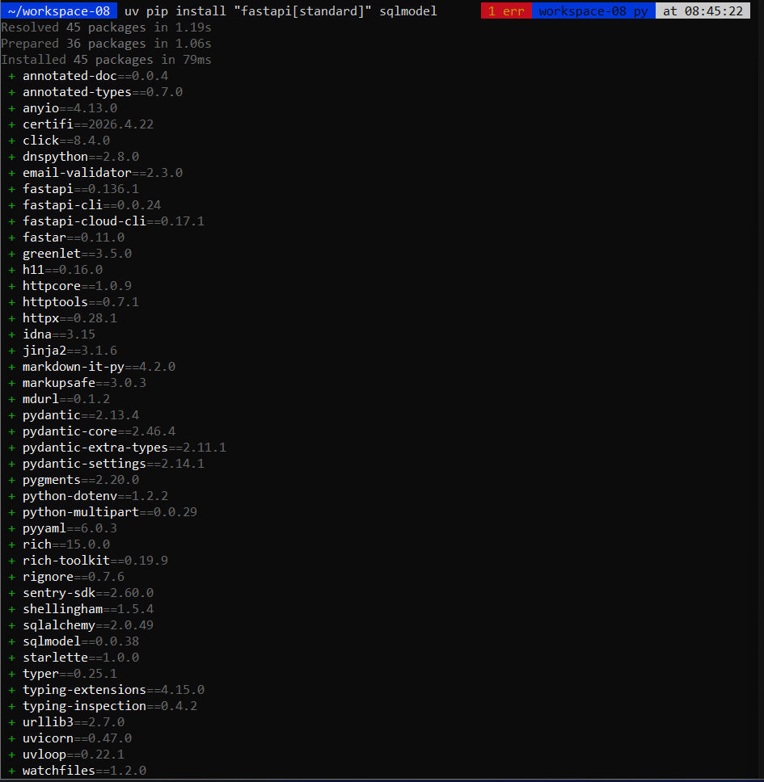


4. **Install SQLite:** Jika belum ada di OS Anda, gunakan perintah:  
```bash
wget https://www.sqlite.org/2026/sqlite-autoconf-3530100.tar.gz

```


5. **Buat Database:**
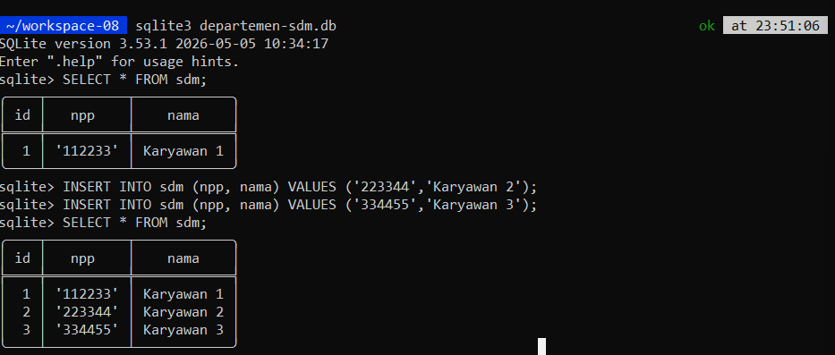


---

## 2. Source Code
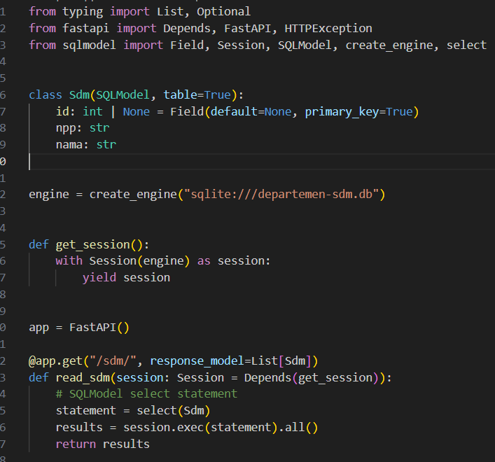


---

## 3. Menjalankan Source Code
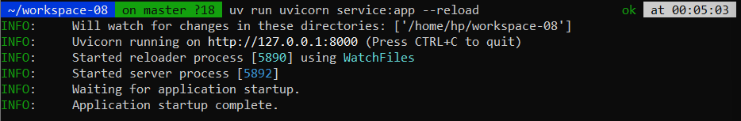


Untuk memeriksa, akses melalui *browser* atau gunakan *headless tool* (`curl` atau `wget`): 
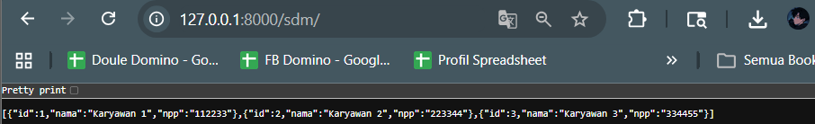
---

## 4. Tugas

### 1. Membuat Tabel Baru

Buat satu tabel baru di SQLite (berbeda dengan contoh) yang memiliki 1 *primary key* dan setidaknya berisi kolom dengan tipe data: `INT`, `CHAR`, `VARCHAR`, `BOOLEAN`, dan `FLOAT`.
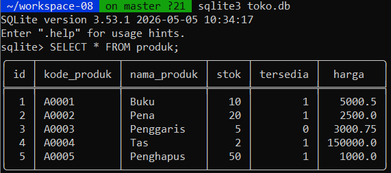

### 2. Mengisi Data

Isikan 5 data ke dalam tabel menggunakan script Python.
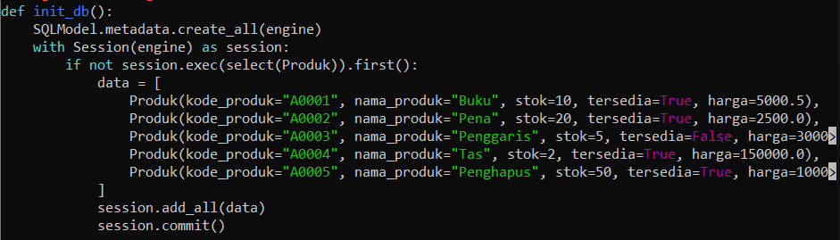

### 3. Membuat RESTful API Endpoint

Buat endpoint untuk menampilkan semua data yang telah diisikan.
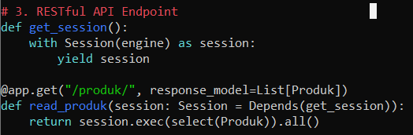

### 4. Verifikasi Hasil

Tampilkan hasil RESTful API endpoint tersebut menggunakan `curl`.
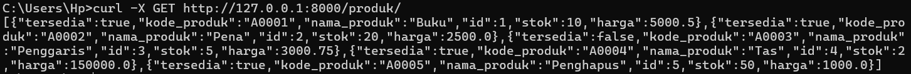