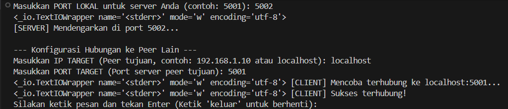
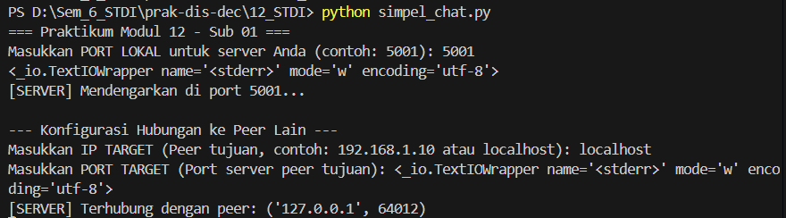

# 📡 Modul 12: Teknologi P2P (Peer-to-Peer)
**Praktikum Sistem Terdistribusi dan Terdesentralisasi**  
Universitas Teknologi Digital Indonesia | Prodi Informatika  
Penulis: Aditya Wisnu Naraya (235410069)

---

## 📑 Daftar Isi
1. [Pengantar Teknologi P2P](#0-pengantar-teknologi-p2p)
2. [Koneksi Antar Nodes (Simple Chat)](#1-koneksi-antar-nodes-simple-chat)
3. [Distributed Hash Table (DHT)](#2-distributed-hash-table-dht)
4. [Torrent Metadata Reader](#3-torrent-metadata-reader)

---

## 0. Pengantar Teknologi P2P
Teknologi P2P terdiri atas sekumpulan *nodes* yang terhubung secara langsung tanpa adanya suatu server yang menjadi perantara. Setiap *node* dapat berfungsi sebagai *client* sekaligus *server*. 

**Kemungkinan Penggunaan:**
1. Berbagi file (*File sharing*)
2. Aplikasi Chat
3. Aplikasi Games

---

## 1. Koneksi Antar Nodes (Simple Chat)
Program ini mendemonstrasikan koneksi antar node menggunakan Python (`socket` dan `threading`), di mana satu program dapat bertindak sebagai penerima (*server*) dan pengirim (*client*) pesan secara bersamaan.



*Gambar 1: Demonstrasi chat berhasil antara dua node yang saling terhubung.*

### 📝 Penjelasan Bagian Program
Berdasarkan kode `simple_chat.py`, berikut adalah penjelasan bagian-bagian kuncinya:

*   **a. Membuka port yang akan menerima dan mengirim pesan:**  
    Dilakukan oleh baris `server_socket.bind(('0.0.0.0', port_saya))` dan `server_socket.listen(1)`. Fungsi `bind` mengikat socket ke alamat IP dan port tertentu, sementara `listen` membuat socket siap menerima koneksi masuk.
*   **b. Menerima pesan:**  
    Dilakukan oleh fungsi `terima_pesan()`, khususnya pada baris `koneksi, alamat_peer = server_socket.accept()` untuk menerima koneksi, dan `data = koneksi.recv(1024)` untuk membaca data (pesan) yang dikirim oleh peer.
*   **c. Mengirim pesan:**  
    Dilakukan oleh fungsi `kirim_pesan()`, khususnya pada baris `client_socket.connect((ip_tujuan, port_tujuan))` untuk menyambung ke peer, dan `client_socket.sendall(pesan.encode('utf-8'))` untuk mengirimkan string pesan yang telah di-encode.

---

## 2. Distributed Hash Table (DHT)
DHT adalah mekanisme yang digunakan teknologi P2P untuk pencarian data tanpa server pusat. Program `dht.py` mensimulasikan lingkaran DHT (*DHT Ring*) di mana setiap node memiliki ID unik (hash 8-bit dari nama node), dan data disimpan di node yang ID-nya paling dekat (lebih besar atau sama dengan) dengan hash dari nama file.

### 📸 Hasil Eksekusi Program
> 💡 **Tips Screenshot:** Screenshot terminal yang menampilkan output saat program dijalankan. Pastikan terlihat bagian "Urutan Node dalam Lingkaran DHT", proses "[SIMPAN]", dan hasil "[PENCARIAN]" (baik yang SUKSES maupun GAGAL).

  
*Gambar 2: Output simulasi penyimpanan dan pencarian data pada Lingkaran DHT.*

### 📝 Penjelasan Singkat Program
Program ini membuat 3 node (Node A, B, C) dan menghitung ID unik untuk masing-masing node menggunakan hash SHA1 8-bit. Node-node ini diurutkan dalam sebuah "Lingkaran DHT". Saat data disimpan, program menghitung hash nama file, mencari node terdekat yang ID-nya $\ge$ hash file tersebut, dan menyimpan data di *local storage* node itu. Saat pencarian, proses routing yang sama dilakukan untuk menemukan node yang menyimpan data tersebut.

### 📝 Algoritma Pencarian Data pada DHT
1. **Input:** Terima `nama_file` yang ingin dicari.
2. **Hashing:** Hitung `key_data` = `hash_8bit(nama_file)`.
3. **Routing:** Iterasi melalui `daftar_node` yang sudah terurut.
   - Jika ditemukan `node.id >= key_data`, maka `node_target` = node tersebut.
   - Jika tidak ada yang memenuhi (hash lebih besar dari semua ID node), maka `node_target` = node pertama dalam daftar (karena sifat melingkar/ring).
4. **Pencarian Lokal:** Periksa apakah `key_data` ada di dalam `node_target.penyimpanan_lokal`.
5. **Output:** 
   - Jika ada: Kembalikan konten data (SUKSES).
   - Jika tidak ada: Tampilkan pesan data tidak ditemukan (GAGAL).

---

## 3. Torrent Metadata Reader
Torrent adalah teknologi P2P untuk berbagi file besar. File `.torrent` berisi metadata tentang file yang akan didistribusikan. Program ini membaca dan mendekode (*bdecode*) file `.torrent` untuk menampilkan informasi seperti Tracker URL, nama file, ukuran, dan Info Hash.

### 📸 Hasil Eksekusi Program
> 💡 **Tips Screenshot:** Screenshot terminal saat menjalankan program yang sudah dimodifikasi (menggunakan argumen). Tunjukkan perintah `python read_torrent.py namafile.torrent` dan output metadata yang berhasil muncul.

  
*Gambar 3: Output pembacaan metadata dari file .torrent menggunakan argumen command-line.*

### 📝 Penjelasan Output Program
Program memberikan output tersebut karena:
1. Membuka file `.torrent` dalam mode *binary* (`'rb'`).
2. Menggunakan library `bcoding` untuk mendekode format *Bencode* khas Torrent menjadi dictionary Python.
3. Mengambil nilai dari key `'announce'` (URL Tracker).
4. Mengambil dictionary `'info'` untuk mendapatkan `'name'`, `'length'` (ukuran dalam bytes), dan `'piece length'`.
5. Menghitung `info_hash` dengan melakukan *bencode* ulang pada dictionary `'info'`, lalu di-hash menggunakan SHA1. Ini adalah identitas unik torrent tersebut di jaringan P2P.
6. Menghitung jumlah *pieces* dengan membagi panjang string `'pieces'` dengan 20 (karena setiap hash piece berukuran 20 bytes).

### 📝 Kode Program yang Dimodifikasi (Fleksibel dengan Argumen)
Berikut adalah kode `read_torrent.py` yang telah diubah agar nama file `.torrent` dapat diterima sebagai parameter/argumen command-line, sesuai dengan tugas praktikum:

```python
import sys
import bcoding
import hashlib

def baca_metadata_torrent(path_file_torrent):
    print(f"=== ANALISIS METADATA TORRENT: {path_file_torrent} ===")
    try:
        with open(path_file_torrent, 'rb') as f:
            data_torrent = bcoding.bdecode(f)
            
            print(f"[TRACKER URL] : {data_torrent.get('announce')}")
            
            info = data_torrent.get('info')
            if info:
                print(f"[NAMA FILE]   : {info.get('name')}")
                print(f"[UKURAN FILE] : {info.get('length')} bytes")
                print(f"[UKURAN PIECE]: {info.get('piece length')} bytes")
                
                info_bencoded = bcoding.bencode(info)
                info_hash = hashlib.sha1(info_bencoded).hexdigest()
                print(f"[INFO HASH]   : {info_hash}")
                
                jumlah_pieces = len(info.get('pieces')) // 20
                print(f"[TOTAL PIECES]: {jumlah_pieces} potongan")
            else:
                print("[ERROR] Tidak ditemukan bagian 'info' pada file torrent.")
                
    except FileNotFoundError:
        print(f"Gagal: File '{path_file_torrent}' tidak ditemukan. Pastikan path benar.")
    except Exception as e:
        print(f"Error saat membaca torrent: {e}")

if __name__ == "__main__":
    # Memastikan user memberikan argumen file torrent
    if len(sys.argv) < 2:
        print("Penggunaan: python read_torrent.py <namafile.torrent>")
        print("Contoh   : python read_torrent.py FreeBSD-15.0-RELEASE-amd64-bootonly.iso.torrent")
        sys.exit(1)
        
    file_torrent = sys.argv[1]
    baca_metadata_torrent(file_torrent)
