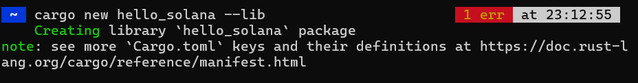
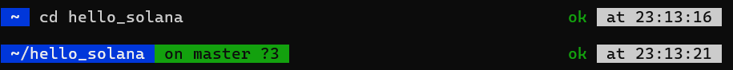
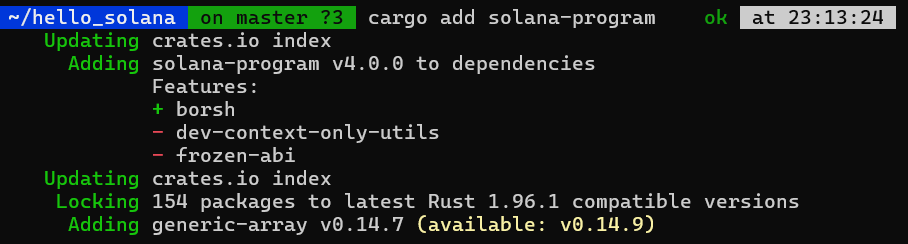
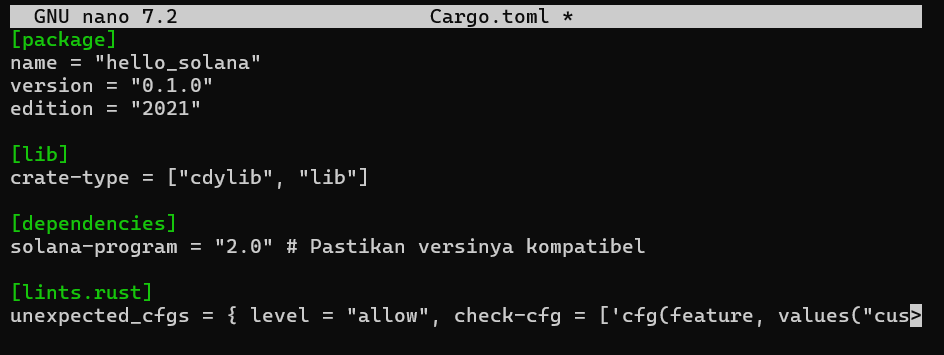
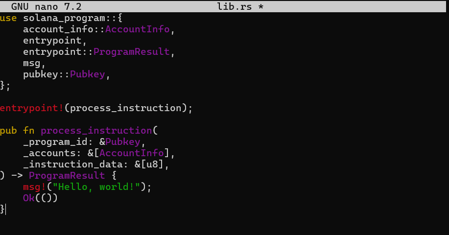
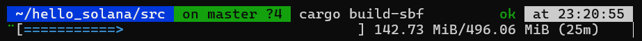

Nama    : Aditya Wisnu Naraya  
NIM     : 235410069  
Kelas   : Informatika-2  

Bagian 1: Smart Contract Native Rust
Metode ini menggunakan Rust murni tanpa framework tambahan.
1. Membuat Proyek Baru
Buat proyek library Rust baru dan tambahkan dependensi Solana.

2. Konfigurasi Cargo.toml
Edit file Cargo.toml untuk menentukan tipe crate dan menangani warning kompilasi.

3. Menulis Smart Contract (src/lib.rs)
Ganti isi src/lib.rs dengan kode berikut:

4. Build Smart Contract
Gunakan perintah khusus Solana untuk membangun program menjadi Shared Object (.so).

