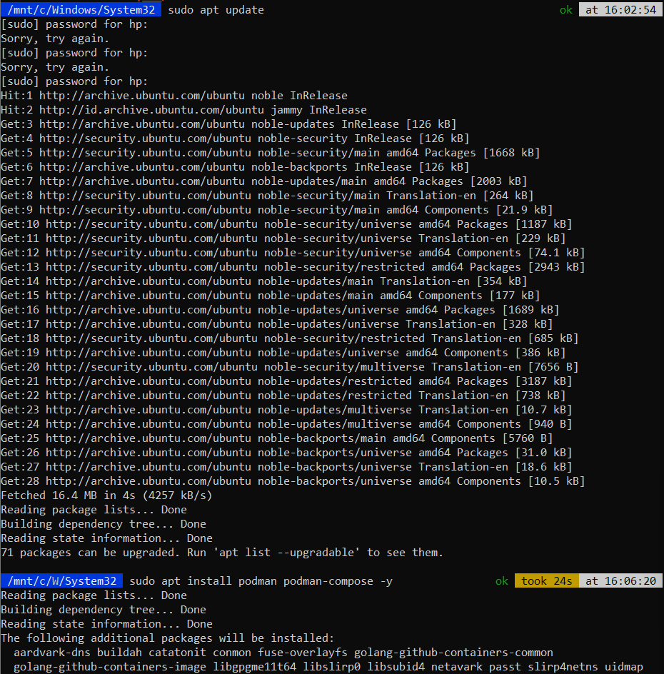
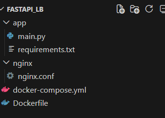
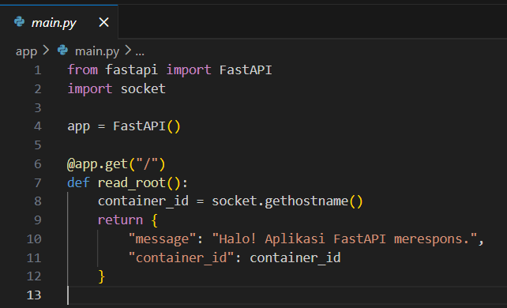
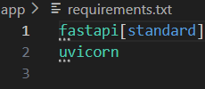
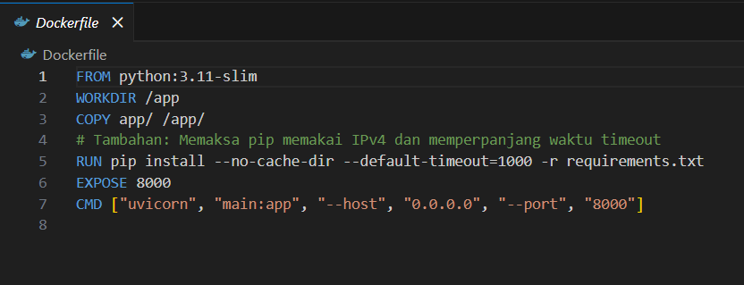
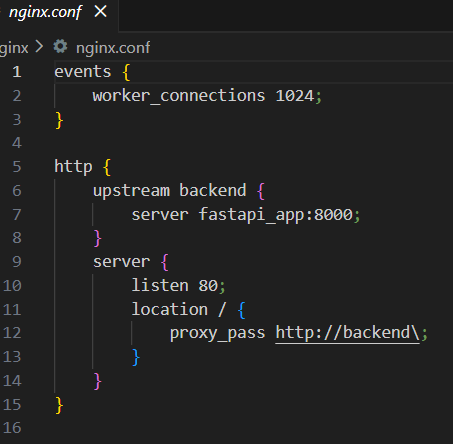
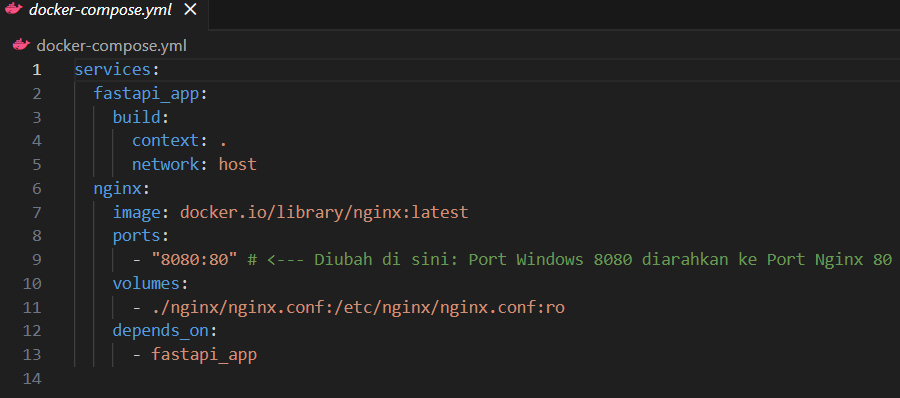

UTS  
Nama: Aditya Wisnu Naraya  
NIM : 235410069  
=====
1. Instalasi Podman di Ubuntu (WSL)
Secara bawaan, Podman belum terinstal di Ubuntu. bisa menginstalnya beserta podman-compose menggunakan paket manajer apt. Buka terminal WSL Ubuntu dan jalankan:  
sudo apt update  
sudo apt install podman podman-compose -y 

2. Persiapan Struktur Direktori
Buat sebuah direktori kerja baru (misalnya fastapi_lb) dan buat struktur file seperti berikut
  

3. Membuat Kode Aplikasi (FastAPI)
Kita akan membuat aplikasi sederhana yang mengembalikan hostname (ID Container). Ini sangat penting agar kita bisa melihat secara visual bahwa load balancer benar-benar membagi traffic ke container yang berbeda-beda.
Isi file app/main.py:

Isi file app/requirements.txt:

4. Membuat Dockerfile untuk PodmanPodman  sepenuhnya kompatibel dengan format Dockerfile. File ini menginstruksikan bagaimana aplikasi FastAPI kita akan dibungkus menjadi Containerized App (CA).  
Isi file Dockerfile:

5. Konfigurasi Load Balancer (Nginx)Kita perlu mengatur Nginx agar bertindak sebagai Reverse Proxy sekaligus Load Balancer yang mengarahkan traffic masuk ke grup aplikasi (upstream).  Isi file nginx/nginx.conf:

5. Konfigurasi Orkestrasi (docker-compose.yml)Untuk mempermudah menjalankan Nginx dan beberapa replika FastAPI sekaligus, kita menggunakan Compose. Podman dapat mengeksekusi file docker-compose.yml menggunakan perintah podman-compose atau podman compose.  Isi file docker-compose.yml:

6. Menjalankan Sistem menggunakan Podman  
Berbeda dengan Docker yang membutuhkan daemon (dockerd) yang berjalan di latar belakang, Podman bersifat daemonless. Pastikan sudah menginstal podman dan podman-compose.  Buka terminal di dalam direktori fastapi_lb/ dan jalankan perintah berikut untuk membangun image dan langsung menjalankan 3 buah replika (instance) aplikasi FastAPI:  Bashpodman-compose up --build --scale fastapi_app=3 -d
Catatan: --scale fastapi_app=3 memerintahkan Podman untuk membuat 3 container FastAPI kembar yang akan di-load balance oleh Nginx.Kamu bisa mengecek container yang sedang berjalan dengan:Bashpodman ps
melihat 1 container Nginx dan 3 container fastapi_app.

7. Pengujian (Verifikasi Load Balancing)  
Sekarang, cobalah kirimkan request ke Nginx yang berjalan di localhost port 80. bisa menggunakan perintah curl di terminal  secara berulang-ulang:  Bashcurl http://localhost
Hasil yang diharapkan:Jika menjalankan perintah di atas berkali-kali, perhatikan bagian "container_id". Nilainya akan berubah-ubah (misalnya a1b2c3d4e5f6, lalu f9e8d7c6b5a4, dst).Hal ini membuktikan bahwa Nginx telah sukses berfungsi sebagai Load Balancer, membagi beban permintaan (request) ke 3 container Podman (FastAPI) yang berbeda secara bergantian (Round Robin).